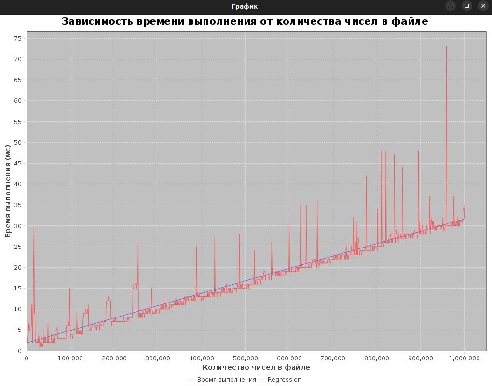

<h1 align="center"> Техническая документация по ТЗ2 </h1>

        
 Файл 'input.txt' располагается в директории src. 

        
 Целые числа в файле записаны в одной строке, друг от друга отделены пробелами. 
            В файле есть минимум одно число. Максимально возможное количество чисел в файле - 1 млн. 

1. `_min` - функция принимает на вход файл, содержащий массив целых чисел и возвращает один элемент целое число - минмиальное значение этого массива
2. `_max` - функция принимает на вход файл, содержащий массив целых чисел и возвращает один элемент целое число -  максимальное значение этого массива
3. `_sum` - функция принимает на вход файл, содержащий массив целых чисел и возвращает один элемент целое число -  сумму всех элементов этого массива 
4. `_mult` - функция принимает на вход файл, содержащий массив целых чисел и возвращает один элемент целое число -  произведение всех элементов этого массива

Тесты расположены в файле MainTest.java

Построение графика времени выполнения относительно кол-ва файлов реализовано в NumberProcessorTest.java

Github Actions - CI система. Программа проходит тесты при каждом push, есть возможность
ручного запуска тестов. Результат каждого теста отправляется в телеграмм чат https://t.me/+6zdx_LxE-f5lNTFi

